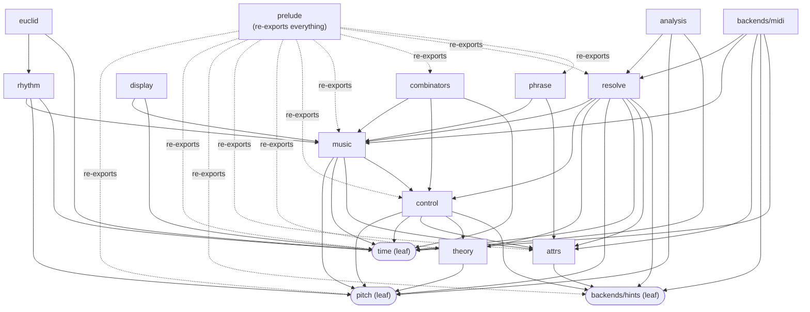
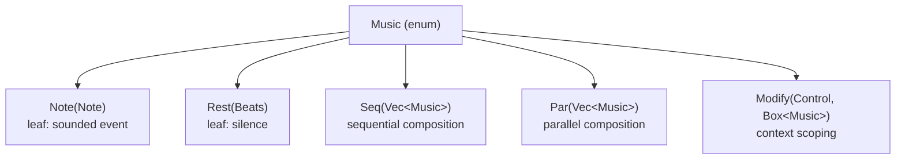

# Architecture

`musecode_core` is the kernel of the `muse` musical DSL. It is small by design: five core ADT constructors, a polymorphic pitch hierarchy, rational time, and content-addressed fragments. Every higher-level construct (chord voicings, canon, swing) is built from these primitives without extending the core types.

---

## Module Dependency Graph



**Solid arrows mean "imports from." Dashed arrows are re-exports from `prelude`.** No cycles.

| Module | Imports from |
|--------|-------------|
| `pitch` | nothing (leaf) |
| `time` | nothing (leaf) |
| `backends/hints` | nothing (leaf) |
| `attrs` | `backends/hints` |
| `theory` | `pitch` |
| `control` | `pitch`, `time`, `attrs`, `theory`, `backends/hints` |
| `music` | `pitch`, `time`, `attrs`, `control` |
| `combinators` | `music`, `control`, `time` |
| `display` | `music`, `time` (plus `Display` impls that live in each type's own module) |
| `resolve` | `music`, `control`, `theory`, `pitch`, `time`, `attrs`, `backends/hints` |
| `rhythm` | `music`, `pitch`, `time` |
| `euclid` | `rhythm`, `time` |
| `analysis` | `resolve`, `pitch`, `time` (and `music` for the `summary` argument) |
| `backends/midi` | `resolve`, `music`, `attrs`, `backends/hints`, `time` (plus the `midly` crate) |
| `phrase` | `music`, `attrs` |
| `prelude` | everything |

The key structural decision: `attrs` is a shared leaf module that both `control` and `music` import. This breaks the potential cycle that would arise if `Music::Modify(Control, _)` caused `music` and `control` to depend on each other.

---

## The Seven Layers

### Layer 1: Pitch (`pitch`)

The pitch hierarchy has three tiers:

1. **`PitchClass`** = `Letter` + `Accidental`. No octave. Enharmonic spelling is preserved (C# and Db are distinct values even though `semitones()` returns the same integer for both).
2. **`ChromaticPitch`** = `PitchClass` + `octave: i8`. Fully resolved. C4 = MIDI 60.
3. **`Pitch`** = polymorphic union of `Chromatic(ChromaticPitch)`, `Degree(Degree)`, and `Interval(Interval)`.

`Degree` and `Interval` are unresolved until a `Control::Key` / `Control::Scale` context is present. Backends receive only `ChromaticPitch`; the `resolve` module is the one pass that performs that resolution, and every backend consumes its output.

### Layer 2: Time (`time`)

`Beats = Rational32` from the `num-rational` crate. Quarter note = `1/1`, eighth = `1/2`, dotted quarter = `3/2`. Duration arithmetic is exact integer arithmetic with no floating-point accumulation.

Duration helpers are functions rather than `const` items because `Rational32::new` is not a `const fn`.

### Layer 3: Core ADT (`music`, `attrs`, `control`)

The `Music` enum has exactly five constructors:



`Seq` and `Par` flatten on composition: the `Add` and `BitOr` operator implementations merge adjacent sequences and parallels instead of nesting them. A chain `a + b + c + d` produces `Seq([a, b, c, d])`, not `Seq([Seq([Seq([a, b]), c]), d])`. Tree depth stays proportional to actual musical structure.

`Modify` is how context propagates. Wrapping a subtree in `Modify(Control::Key(k), body)` changes how degree-pitches and diatonic transpositions resolve inside `body` without affecting sibling or parent nodes.

### Layer 3: Notation (`display`)

`impl Display for Music`, and the grammar it prints is specified in `docs/NOTATION.md`. It sits at layer 3 because it needs nothing above `music` and `time`: a note is `pitch:dur` plus its attribute suffix, a rest is `r:dur`, a `Par` of same-duration notes with identical attributes collapses to a chord `[C4 E4 G4]:h`, any other `Par` is `{ piece | piece }`, a `Modify` is `ctrl { piece }`, and a `Seq` inside a `Seq` is parenthesised. A `Seq` of leaves prints on one line and a `Seq` with compound children prints one child per line, which is what makes a piece read one bar per line.

Whitespace carries no meaning, so the printer is free about layout and the parser is free about reading it. That freedom is the point: what this module prints is exactly what the M2 text parser (#14) must accept, so `NOTATION.md` is the contract between the two halves, written before the parser exists.

### Layer 4: Theory (`theory`, `control`)

`Key`, `Scale`, `Mode`, `Chord`, `ChordQuality`, `Extension`, and `Voicing` live here. These are purely data types with no resolution logic. Resolution (mapping a `Degree` in key F minor to a specific `ChromaticPitch`) belongs in the rendering backend.

`Control` is a 12-variant enum of modifiers that can be wrapped around any `Music` subtree.

### Layer 5: Resolver (`resolve`)

The semantic pass. `resolve(&Music) -> Result<Resolved, ResolveError>` walks the tree with an accumulated context (key, scale override, chromatic and diatonic transposition, dynamics, articulation, voice, instrument, hints) and emits a flat, onset-sorted list of `Event`s with fully resolved `ChromaticPitch`es, velocities and sounding durations, plus a tempo map and time-signature map. Degrees anchor on the tonic in octave 4 and are spelled from the scale step; intervals anchor on the previous note in the same `Seq` branch; ties merge within a branch. Every reachable mistake is a `ResolveError`, never a panic. The rules are listed in the module docs and in `docs/API.md`.

### Layer 5: Analysis (`analysis`)

Structural facts over the resolver's events: `pitch_range`, `pitch_class_set` (a 12-bit set plus the spelled classes), `interval_histogram` (melodic steps per voice), `vertical_slices` (what sounds at each onset) and `label_triad` (major, minor, diminished, augmented, sus2, sus4 in any inversion). `summary(&Music)` resolves a tree and prints all of it in one string. Every function takes `&[Event]` so it composes with anything a backend produces or consumes.

### Layer 5: Combinators (`combinators`)

Pure functions on `Music`. All take a `Music` value and return a transformed one. No mutation. Designed to compose:

```rust
melody
    .transpose(5)
    .augment(h())
    .retrograde()
    .pipe(canon(vec![(q(), 7)]))
```

Methods implemented on `Music` directly:
- `transpose`, `diatonic_transpose`: wrap in `Modify`
- `augment`, `diminish`: tree walk multiplying all `Beats` values
- `retrograde`: reverses `Seq` children recursively
- `invert`: maps `ChromaticPitch` values by reflecting around an axis
- `map_notes`, `map_rests`: structural recursion primitives
- `pipe`: apply any `FnOnce(Music) -> Music` inline

Free functions: `canon` (implemented), `swing` and `humanize` (declared, panic with `todo!()`, scheduled for M3).

### Layer 5: Rhythm (`rhythm`)

Rhythm as a value with no pitch. A `Pattern` is a list of `Step`s, each a hit or a rest with a rational duration. `then` concatenates, `repeat` loops, and pitch is applied last: `on(pitch)` strikes every hit on one pitch, `with(pitches)` cycles pitches over the hits. Both return a plain `Seq`, so nothing is added to the IR. The module ships the figures the tango repertoire is built on: `tresillo` (q. q. q, the nuevo-tango bass), `habanera` (e. s e e), `cinquillo` (e s e s e) and `straight(n, dur)`. It imports `music`, `pitch` and `time` only: no `control`, no `theory`, no backend, so a rhythm can never depend on a key or a renderer.

### Layer 5: Euclidean Rhythms (`euclid`)

Bjorklund's algorithm (Toussaint 2005): `bjorklund(hits, steps)` spreads `hits` as evenly as possible over `steps` and returns a boolean grid, `euclid(hits, steps, step)` turns that grid into a `Pattern` whose slots all last `step`. The grid transforms live here because they are what one does with a grid: `from_grid`, `grid` (the `x..x..x.` picture), `rotate` (move the downbeat), `complement` (swap hits and rests) and `legato` (each hit absorbs the rests after it, which is how a grid becomes a bass line). `euclid(3, 8, e()).legato() == tresillo()` is a test, not a coincidence. Imports `rhythm` and `time` only.

### Layer 6: Backend Hints (`backends/hints`)

`BackendHint` is an additive metadata enum attached to `NoteAttrs`. Three sub-enums:

- `LilypondHint`: stem direction, beam marks, raw `\markup` escapes, layout flags
- `MidiHint`: program change, channel, CC values
- `AudioHint`: keyswitch note, articulation name, mic position, round-robin index

A backend that doesn't understand a hint ignores it. The IR itself (`Music`) carries no backend-specific state.

### Layer 6: MIDI Export (`backends/midi`)

The first renderer. `render_midi(&Music, &MidiOptions)` resolves the tree and hands the `Resolved` events to `render_resolved`, which writes a format 1 Standard MIDI File through the `midly` crate: track 0 is the conductor track (tempo and time-signature meta events, `120 bpm` and `4/4` supplied when the piece states neither), then one track per voice in order of first appearance, each on the next free channel with channel 9 (GM percussion) skipped. Programs come from a `MidiHint::ProgramChange` on the note, else the note's `InstrumentId` through the GM table in `program_for`, else `MidiOptions::default_program`; a program change is written whenever that differs from what the channel last received. Ticks are `beats * ppq`, exact for every duration helper at the default 480 PPQ. `write_midi` puts the bytes on disk. Every failure is a `MidiError` (`Resolve`, `Io`, `InvalidPpq`, `ZeroTempo`, `BadTimeSignature`, `PitchOutOfMidiRange`, `TickOverflow`), never a panic. The backend consumes `Resolved` and never reads `Music` for meaning: it may import `resolve`, `music`, `attrs`, `backends/hints` and `time`, never `combinators`, `theory`, `analysis` or `display`.

### Layer 7: Phrases (`phrase`)

`Phrase` wraps a `Music` tree in an `Arc<Music>` and stores its Blake3 hash (computed via `bincode` serialization). Two `Phrase`s with the same hash are structurally identical.

`RenderCache<O>` maps `(blake3::Hash, BackendId)` to rendered output `O`. When a large piece changes only one section, only that section's subtree hash is new; everything else is a cache hit.

---

## Design Decisions

### Why exactly five constructors?

Hudak's "The Haskell School of Music" showed that `Note`, `Rest`, `Seq`, `Par`, and a context modifier cover the entire space of structured music. A sixth constructor would either be redundant (expressible as a tree of the five) or would embed backend-specific knowledge into the IR (violating principle 5).

### Why `Modify` with a single `Control`, not `Vec<Control>`?

Simpler canonical form. If multiple controls are needed for a section, nest two `Modify` nodes. The order of nesting becomes explicit and meaningful (inner shadows outer). This is an open question flagged in the README: `Vec<Control>` would save tree depth at the cost of canonicality.

### Why not GATs or higher-kinded types for the polymorphic pitch?

Rust's type system could express "a `Music<P>` parameterized by pitch type P" with GATs, making the resolved/unresolved distinction a compile-time guarantee. The design deliberately avoids this. The ergonomic cost of propagating a type parameter through every combinator and operator outweighs the safety benefit, especially since resolution errors surface clearly at render time.

### Why `attrs` as a separate module?

To prevent a circular dependency. Both `music` and `control` need `Articulation`, `NoteAttrs`, and `VoiceId`. If these lived in `music`, then `control` would need to import `music`, but `music` imports `control` for the `Music::Modify` constructor. `attrs` as a shared leaf breaks the cycle cleanly.

---

## Dependency Constraints (for future maintainers)

- `pitch`, `time`, `backends/hints` must never import other internal modules
- `attrs` must never import `music` or `control`
- `control` must never import `music`
- `combinators` may import `music` and `control` but not `phrase`
- `resolve` must never import `phrase`, `combinators`, or a concrete backend
- `rhythm` may import `music`, `pitch`, `time` only; never `control`, `theory`, `resolve`, or a backend
- `euclid` may import `rhythm` and `time` only
- `analysis` works on `&[Event]` and must never import a backend (`summary(&Music)` is the one convenience that resolves a tree itself)
- `backends/midi` consumes `Resolved`; it must never import `combinators`, `theory`, `analysis`, or `display`
- `phrase` must never import `combinators` or `theory`
