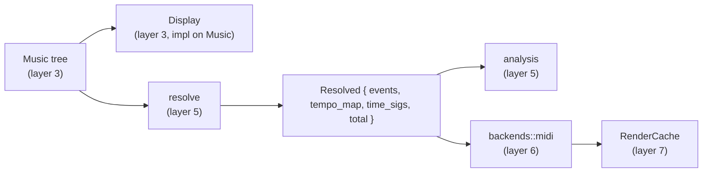
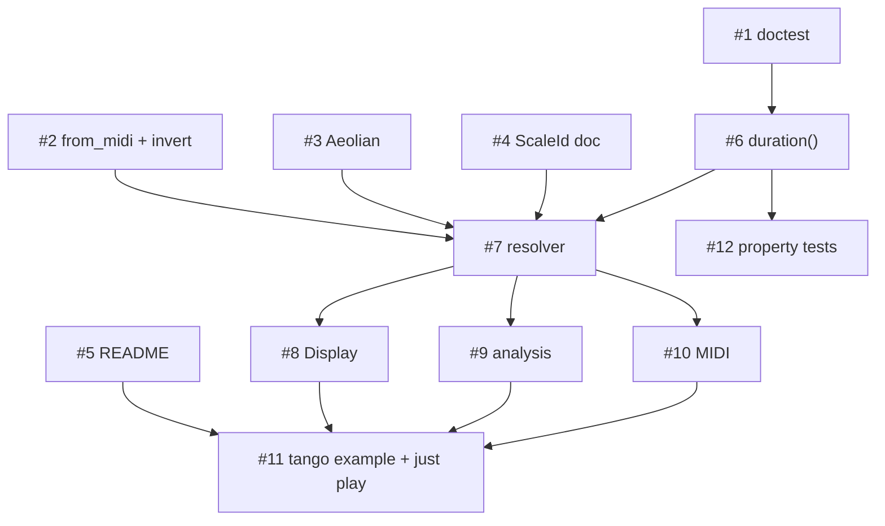

# Milestone 1 design: Hear the tango

## Goal

Give the IR semantics and close the feedback loop. At the end of M1 the README's Piazzolla sketch, unchanged, prints as readable notation, reports its structural facts, and renders to a `.mid` file that plays through `fluidsynth`. Nothing in the five-constructor ADT changes; everything in this milestone is built on top of it.

**Acceptance test:** `just play tango` on the development machine produces audible output, and `cargo test` is green.

## Two decisions that shape the milestone

**Internal Rust DSL before a parsed syntax.** The meaning of `Par`, `Interval` and ties is still open. A grammar frozen over an IR whose semantics have not run would be designed blind. The internal DSL already reads well, the tree is `serde`-serializable, and a parser later is a thin layer over a settled AST. What conversation and analysis need now is the *display* half of a syntax, which M1 builds (`Display`), not the parsing half (M2, #14).

**MIDI before LilyPond.** MIDI is a flat event list; producing it forces the resolver, which is the missing spine. LilyPond needs that same resolver plus spelling, beaming, tie and staff concerns, plus an install that the development machine does not have. `fluidsynth` and five GM soundfonts are already present. Build the spine once; both backends hang off it.

## Scope

**In:** five defect fixes (#1 to #5), `duration()` (#6), the resolver (#7), `Display` and a notation spec (#8), structural analysis (#9), MIDI export (#10), the tango example and `just play` (#11), property tests on the IR laws (#12).

**Out:** LilyPond, text parser, swing, humanize, voicings, chord-symbol parser, in-process audio, tempo ramps, microtonal pitch, hairpin interpolation, ties across `Seq` boundaries, the `Modify(Vec<Control>)` and `Score` questions. Each has an issue in M2 or M3.

## Component map



Two new modules and one new backend. Dependency rules extend the existing table:

| Module | May import | Must never import |
|---|---|---|
| `resolve` | `music`, `control`, `theory`, `pitch`, `time`, `attrs` | `phrase`, `combinators`, `backends::midi` |
| `analysis` | `resolve`, `pitch`, `time` | `music` directly (takes `&[Event]`), `backends` |
| `backends::midi` | `resolve`, `attrs`, `backends::hints`, `time` | `combinators`, `theory` |
| `phrase` | unchanged | unchanged |

`analysis` taking `&[Event]` rather than `&Music` is deliberate: every future backend produces or consumes events, so the analysis vocabulary composes with all of them for free.

## Data types

### `resolve::Event`

```rust
pub struct Event {
    pub onset: Beats,                 // absolute, from the start of the piece
    pub dur: Beats,                   // sounding duration after articulation scaling
    pub written_dur: Beats,           // the notated value, for LilyPond later
    pub pitch: ChromaticPitch,        // fully resolved, spelling preserved
    pub velocity: u8,                 // 1..=127
    pub voice: Option<VoiceId>,
    pub instrument: Option<InstrumentId>,
    pub articulation: Option<Articulation>,
    pub hints: Vec<BackendHint>,      // note hints plus every enclosing Control::Hint
}

pub struct Resolved {
    pub events: Vec<Event>,           // sorted by onset, stable
    pub tempo_map: Vec<(Beats, Tempo)>,
    pub time_sigs: Vec<(Beats, TimeSig)>,
    pub total: Beats,                 // == Music::duration()
}

pub enum ResolveError {
    DegreeZero,
    DegreeWithoutKey,                 // a Degree with no Control::Key in scope
    CustomModeWithoutScale { mode: Mode },
    EmptyScale,                       // Control::Scale with no intervals
    PitchOutOfRange { semitone: i64 },// outside MIDI -1500..=1500, the range whose octave fits an i8
    UnanchoredInterval,               // no previous note and no key to anchor on
    ZeroInterval,                     // generic == 0
    InvalidIntervalQuality { generic: i8, quality: IntervalQuality }, // e.g. a major fifth
    TieMismatch { at: Beats },        // tie_to_next followed by a different pitch or a rest
    UnspellablePitch { semitone: i32, letter: Letter },
}

pub fn resolve(m: &Music) -> Result<Resolved, ResolveError>;
```

Errors, never panics. A DSL that panics on a wrong degree is unusable in conversation.

### `resolve::Context` (private)

Carried down the tree, cloned at each `Modify` and each `Par` child:

```rust
struct Context {
    key: Option<Key>,
    scale: Option<Scale>,             // Control::Scale override, else derived from key.mode; a new Key clears it
    transpose: i64,                   // chromatic semitones, summed across nested Modify (saturating)
    diatonic: i64,                    // scale steps, summed (saturating)
    dynamics: Dynamics,               // default Mf
    articulation: Option<Articulation>,
    voice: Option<VoiceId>,
    instrument: Option<InstrumentId>,
    hints: Vec<BackendHint>,
}
```

Tempo and time signature are not context: a `Control::Tempo` or `Control::TimeSignature` appends `(onset, value)` to the `Resolved` maps as it is met. The previous note, `prev`, is not a context field either; the walk threads it as an argument, as the *untransposed* resolved pitch, and transposition is applied exactly once to every pitch at emit time (so `seq![n(C4, q()), n(+M3).transpose(7)]` gives C4 B4).

(Sketch synced 2026-08-22 to what shipped in PR #28; `DegreeOutOfScale` from the first draft is unreachable because extensions wrap, and was dropped.)

`prev` has branch semantics: a `Seq` threads it through its children; a `Par` gives every child the same `prev` it received and does not thread between them; `Modify` passes it through. This is what makes `Interval` well-defined (ADR-005).

## Resolution rules

### `Music::duration()` (#6)

`Note` and `Rest` return their written duration. `Seq` sums. `Par` returns the **max** of its children; shorter children are padded with silence, never truncated or looped (ADR-003). `Modify` returns the body's duration. Empty `Seq`/`Par` return 0.

### Onsets

`Seq` children start at the running sum of the preceding children's `duration()`. `Par` children all start at the `Par`'s onset. `Modify` does not move time.

### Degree pitches

Given the active key (tonic pitch class, mode) and the scale intervals `S` (from `Control::Scale` if present, else from the mode table), a `Degree { number, alter, octave_shift }`:

1. `number == 0` is `DegreeZero`.
2. `idx = (number - 1) % len(S)`, `wrap = (number - 1) / len(S)`. Degree 8 is the tonic an octave up; 9, 11, 13 wrap naturally.
3. **Anchor (ADR-004):** the tonic sits in octave 4, so degree 1 of F minor is F4 and degree 1 of C major is C4. Absolute semitone of the target is `midi(tonic in octave 4) + S[idx] + alter + 12 * (wrap + octave_shift)`.
4. **Spelling.** For heptatonic scales the letter is the tonic letter advanced `idx` steps. The accidental is the difference between the target semitone and that letter's natural, normalized into `-2..=2`; outside that range is `UnspellablePitch`. This is what spells degree b5 of F minor as **Cb5** rather than B4, which the README and the LilyPond backend both need. Non-heptatonic scales fall back to `ChromaticPitch::from_midi` (sharps-only).
5. The octave is derived from the letter's natural pitch, not the target, so Cb5 (MIDI 71) gets octave 5.
6. `Mode::Custom` with no `Control::Scale` in scope is `CustomModeWithoutScale`.

### Interval pitches (ADR-005)

`Interval { generic, quality }` resolves against `ctx.prev`. If there is no previous note in the branch, it resolves against the tonic anchor (tonic in octave 4) when a key is in scope, otherwise `UnanchoredInterval`. The semitone count comes from the standard table (P1 0, m2 1, M2 2, m3 3, M3 4, P4 5, d5/A4 6, P5 7, m6 8, M6 9, m7 10, M7 11, P8 12; diminished and augmented shift by one from perfect/minor/major; doubly by two). The letter advances by `generic - 1` steps (negative for descending) and the accidental is derived as for degrees, so a M3 above Eb is G and a d5 above B is F, spelled correctly.

### `Control::Transpose(n)`

Applied after a pitch is resolved to chromatic: `midi + n`, respelled with `ChromaticPitch::from_midi` unless `n % 12 == 0`, in which case only the octave moves and the spelling is kept. Sharps-only respelling is an accepted M1 limitation (ADR-008); M2 can replace it with interval-based transposition.

### `Control::DiatonicTranspose(n)`

Applied to `Degree` pitches before resolution: `number + n` with octave borrowing so the number stays at least 1 (degree 1 down one step becomes degree 7 with `octave_shift - 1`). `Chromatic` and `Interval` pitches pass through unchanged in M1, as the README already states.

### Velocity

Per-note `attrs.velocity` wins. Otherwise the context dynamics map through a fixed table: ppp 16, pp 33, p 49, mp 64, mf 80, f 96, ff 112, fff 127, sfz 120, fp 96. `Crescendo` and `Decrescendo` leave the current level unchanged in M1; #19 gives hairpins a real span.

### Sounding duration

Per-note articulation wins over `Control::Articulation`. Staccato multiplies written duration by 1/2, staccatissimo by 1/4, everything else by 1. No default gate shortening: written equals sounding unless an articulation says otherwise, which keeps the rational arithmetic exact.

### Ties

`tie_to_next` on a note merges it with the next event in the same `Seq` branch if that event has the same resolved pitch: one event with summed written and sounding durations. A following rest or different pitch is `TieMismatch`. A tie on the last note of a branch is dropped silently; ties across `Seq` boundaries and into `Par` are M2 (#17).

### Tempo and time signature

`Control::Tempo` and `Control::TimeSignature` append `(onset, value)` to the maps when encountered. `Tempo::Ramp` contributes `from_bpm` only in M1. No entry at onset 0 means the MIDI backend writes 120 bpm and 4/4.

### Voice, instrument, hints

`Event.voice` is `attrs.voice_id` or the context voice. Instrument comes from the context. `Event.hints` is the note's hints followed by every enclosing `Control::Hint`, outermost first.

## Display notation (#8)

`impl Display for Music` prints the tree in a notation that `docs/NOTATION.md` will specify and that the M2 parser (#14) must accept verbatim. Draft grammar:

```
piece    := element (' ' element)*
element  := note | rest | chord | par | modify
note     := pitch ':' dur attrs?
rest     := 'r:' dur
chord    := '[' pitch (' ' pitch)* ']:' dur
par      := '{ ' piece (' | ' piece)* ' }'
modify   := ctrl ' { ' piece ' }'
pitch    := chromatic | degree | interval
chromatic:= letter accidental? octave        C4  Eb5  F#3  Cb5
degree   := ('b'|'#')? number                1  b3  #7  9
interval := ('+'|'-') quality number         +M3  -P5  +m2
dur      := 'w'|'h'|'q'|'e'|'s'|'t' ('.')*   q  e.  h..
          | num '/' den                      3/8  2/3
ctrl     := 'key(' tonic ' ' mode ')' | 'tempo(' bpm ')' | 'time(' n '/' d ')'
          | 'transpose(' n ')' | 'dyn(' level ')' | 'voice(' id ')' | ...
attrs    := '~' (tie) | '.' (staccato) | '>' (accent) | ...
```

The README sketch prints as roughly:

```
key(F minor) { time(4/4) { tempo(96) {
  { G3:e. G3:s G3:e G3:e G3:q G3:q | r:q r:q. | 5:q b5:e 4:e b3:h }
  { C3:e. C3:s C3:e C3:e C3:q C3:q | r:q r:q. | transpose_diatonic(-1) { 5:q b5:e 4:e b3:h } }
  ...
} } }
```

Exact whitespace and line-breaking rules are settled in `docs/NOTATION.md` under #8; the grammar above is the commitment.

## Analysis (#9)

Over `&[Event]`:

| Function | Returns |
|---|---|
| `pitch_range(events)` | lowest and highest `ChromaticPitch`, or `None` |
| `pitch_class_set(events)` | a 12-bit set plus a sorted `Vec<PitchClass>` |
| `interval_histogram(events)` | melodic intervals between consecutive events per voice, as a map from signed semitones to count |
| `vertical_slices(events)` | for each distinct onset, the set of pitches sounding at that instant |
| `label_triad(slice)` | `Major`, `Minor`, `Diminished`, `Augmented`, `Sus2`, `Sus4` with root, or `None` |
| `summary(music)` | one string: total duration, range, pitch-class set, interval histogram, triad labels per slice |

Roman-numeral and functional analysis are deliberately absent; they need key detection and voice-leading rules that belong to a later milestone.

## MIDI backend (#10)

- Crate: `midly` 0.5.x. Format 1, PPQ 480.
- Track 0: conductor. Tempo meta events from `tempo_map`, time-signature meta events from `time_sigs`, end-of-track.
- One track per distinct voice in order of first appearance; `None` voice is its own track. Channel is the track index modulo 16, skipping channel 9, unless a `MidiHint::Channel` on the first event says otherwise.
- Program change at track start from `InstrumentId` via a small GM name table (`"piano"`, `"bandoneon"` to accordion 21, `"contrabass"` 43, and so on) with acoustic grand as fallback; `MidiHint::ProgramChange` on an event overrides for that event onward.
- Ticks: `beats * 480`. Every duration helper, dotted and triplet variant yields an integer (`triplet(ts()) * 480 = 40`). An arbitrary `b(n, d)` that does not is rounded to nearest and documented.
- NoteOn/NoteOff pairs with the event velocity; overlapping same-pitch notes on one channel are allowed in M1.
- Output cached in `RenderCache<Vec<u8>>` under `BackendId("midi")` keyed by the phrase hash.
- `write_midi(&Music, path)` convenience.

## Example and tooling (#11)

`musecode_core/examples/tango.rs` holds the README sketch unchanged and prints `Display`, `summary`, then writes `target/tango.mid`. Justfile:

```
render NAME:   cargo run --example {{NAME}}
play NAME:     just render {{NAME}} && fluidsynth -ni $(ls /usr/share/sounds/sf2/*.sf2 | head -1) target/{{NAME}}.mid
```

CLAUDE.md gains the two recipes and the new dependency rows.

## Build order



Slices, each one PR on top of this branch:

1. Defects: #1, #2, #3, #4, #5. Small, independent, unblock everything.
2. `duration()` (#6) and the property suite (#12).
3. Resolver (#7). The largest slice; lands with its unit tests and nothing else.
4. `Display` (#8) and analysis (#9) in parallel: both read-only over the tree or the events.
5. MIDI (#10), then the example and Justfile (#11), which closes the milestone.

## Architecture decision records

### ADR-001: Internal DSL before parsed syntax
- **Status:** Proposed
- **Context:** A first usable version could be a text language or the existing Rust API.
- **Decision:** M1 ships the Rust API with a `Display` notation. The parser is M2 (#14) and must round-trip `Display`.
- **Consequences:** Fragments live as Rust examples with a compile loop until M2. The notation is fixed by `Display` first, so the parser has a spec before it exists.
- **Alternatives:** Parser first (freezes a grammar before the semantics are known); both at once (doubles the surface with no feedback loop yet).

### ADR-002: MIDI before LilyPond
- **Status:** Proposed
- **Context:** Both rendition modes need the resolver; LilyPond also needs notation-specific passes and a binary not installed here.
- **Decision:** MIDI is the M1 backend. LilyPond is M2 (#13) over the same `Resolved` output.
- **Consequences:** Hearing comes first. `Event.written_dur` is kept alongside the sounding duration so LilyPond loses nothing.
- **Alternatives:** LilyPond first (no audio, more work, external install).

### ADR-003: `Par` pads to the longest child
- **Status:** Proposed
- **Context:** Open design question 2. Unequal-length `Par` children can be truncated, looped or padded.
- **Decision:** `duration(Par) = max(children)`; shorter children are padded with silence.
- **Consequences:** Matches every existing music ADT; `truncate_to` and `loop_to` can be explicit combinators later without touching the constructor.
- **Alternatives:** Truncate (loses notes silently); loop (surprising for a bass under a longer melody).

### ADR-004: Degree anchor is the tonic in octave 4
- **Status:** Proposed
- **Context:** A `Degree` needs an absolute octave to resolve to.
- **Decision:** Degree 1 with `octave_shift 0` is the tonic pitch class in octave 4 (F4 in F minor, C4 in C major). Higher degrees ascend from there; `octave_shift` moves whole octaves.
- **Consequences:** A melody in degree space sits in the same register across keys. `alter` inflects the step of the active scale (`S[idx] + alter`, the only reading that survives a `Control::Scale` override), so in F minor `b3` is Abb4 and the README melody is written `5 b5 4 3`, resolving to C5 Cb5 Bb4 Ab4. (Settled 2026-08-22 on the slice 3 review, option (a) of PR #28.)
- **Alternatives:** Nearest tonic to middle C (ambiguous for F#); explicit octave on every degree (verbose, defeats the purpose).

### ADR-005: Interval anchors to the previous note in the same `Seq` branch
- **Status:** Proposed
- **Context:** "Relative to the previous note" is undefined at the start of a branch and inside `Par`.
- **Decision:** The resolver threads `prev` through `Seq`; each `Par` child inherits the `prev` from before the `Par` and does not see its siblings; with no `prev`, the tonic anchor of ADR-004 is used; with no key either, it is an error.
- **Consequences:** Interval melodies are deterministic and voice-local. Two `Par` voices written in intervals both start from the same reference.
- **Alternatives:** Error on any unanchored interval (too strict for a first note); global previous note across `Par` (order-dependent, surprising).

### ADR-006: Remove `Mode::Aeolian`
- **Status:** Proposed
- **Context:** `Minor` and `Aeolian` are documented as identical but hash differently, breaking content addressing (#3).
- **Decision:** Delete the `Aeolian` variant; the `Minor` doc names Aeolian as its modal name.
- **Consequences:** One canonical spelling; `Phrase` equality is trustworthy. A breaking change in a 0.1 crate with no users.
- **Alternatives:** Normalize in `Key::new` (keeps two spellings alive in pattern matches).

### ADR-007: The resolver returns errors, never panics
- **Status:** Proposed
- **Context:** Degree 0, a custom mode without a scale, an unanchored interval and a mismatched tie are all reachable from user code.
- **Decision:** `resolve` returns `Result<Resolved, ResolveError>` with one variant per condition, each unit-tested.
- **Consequences:** Callers decide; the example prints the error. Backends take `&Resolved` and cannot fail on musical grounds.
- **Alternatives:** Panics (unusable in conversation); silent fallbacks (hide bugs in the composition).

### ADR-008: Sharps-only respelling after chromatic transpose (M1 limitation)
- **Status:** Proposed
- **Context:** `Transpose(n)` on a resolved pitch needs a spelling for the result.
- **Decision:** `ChromaticPitch::from_midi` (sharps) unless `n` is a multiple of 12. Recorded as a known limitation.
- **Consequences:** `transpose(7)` of Eb4 prints as A#4, not Bb4. Audio is unaffected; LilyPond (M2) will want interval-based transposition, which is a self-contained follow-up.
- **Alternatives:** Interval-based transposition now (more code in M1 for a backend M1 does not have).

## Test strategy

- Unit tests per resolution rule with hand-computed expectations, including every `ResolveError` variant (#7).
- The README melody in F minor as a fixture used by #7, #9, #10 and #11, so the four slices agree on one piece.
- Property tests (#12) over generated trees for the IR laws, and `from_midi(m).midi() == m` over `-24..=150` (#2).
- MIDI round-trip: encode, decode with `midly`, compare note pairs and tick distances (#10).
- Acceptance: `just play tango` heard on the development machine, recorded in the PR that closes #11.

## Risks

- `midly` 0.5 API details (track event construction, meta message types) are not yet read; the issue says to confirm against the crate docs before writing, not from memory.
- `Rational32` numerators overflow past roughly 2 billion; a piece would need millions of beats to hit it. Not a concern for M1; noted for long generative pieces later.
- Interval quality semitone table and the heptatonic spelling algorithm are the two places a musical mistake would hide; both get exhaustive small tests.
- `fluidsynth -ni` blocks until playback ends; acceptable for `just play`.

## Open for M2

Carried, not decided here: `Modify(Vec<Control>)` (#15), `Score`/voices (#16), ties across boundaries (#17), `chord()` in degree space (#18), hairpins (#19).
